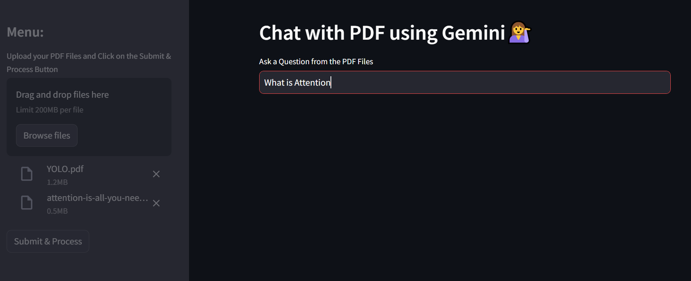

### Chat with Multiple PDFs using LangChain and Gemini 

Image 1: Represents the developed user interface, showcasing the design and layout.

Image 2: Depicts a user uploading pdf file and inputting their query into the dialogue box.

Image 3: Illustrates the response generated by the application based on the user's input.

## Project Overview
This project enables users to interact with PDF files by asking questions and receiving answers using Google's Gemini AI model. The application processes PDF files by extracting text, breaking it into manageable chunks, storing the text in a vector database using FAISS, and allowing for conversational queries. The queries are matched against the stored content, and if the answer is found, it is generated using a language model.

The app is built with **Streamlit** for the front end, **Google Generative AI** for embeddings and conversational chains, and **FAISS** for efficient document retrieval. It is designed to simplify interaction with large PDF files by turning them into a conversational experience.

## Features
- **PDF Text Extraction**: Upload multiple PDFs, extract text, and process it.
- **Text Chunking**: Break large texts into chunks for better management and retrieval.
- **Vector Storage**: Store chunks in a FAISS vector database for efficient semantic search.
- **Google Embeddings**: Use Google Generative AI embeddings for vectorization.
- **Conversational AI**: Ask questions and receive detailed answers from the uploaded PDFs using a conversational chain powered by Google's Gemini AI.

## How It Works
1. **Upload PDFs**: Users can upload one or more PDF files through the Streamlit interface.
2. **Text Extraction and Chunking**: The app reads the uploaded PDFs and extracts the text. This text is split into chunks to improve search accuracy.
3. **Store in FAISS**: The text chunks are embedded using Google Generative AI embeddings and stored in a FAISS vector database.
4. **Ask Questions**: Users can type a question in the input box, and the system will search for the most relevant text from the PDF's vector database.
5. **Conversational Response**: A conversational AI model (Google Gemini AI) uses the relevant context to generate detailed answers.

